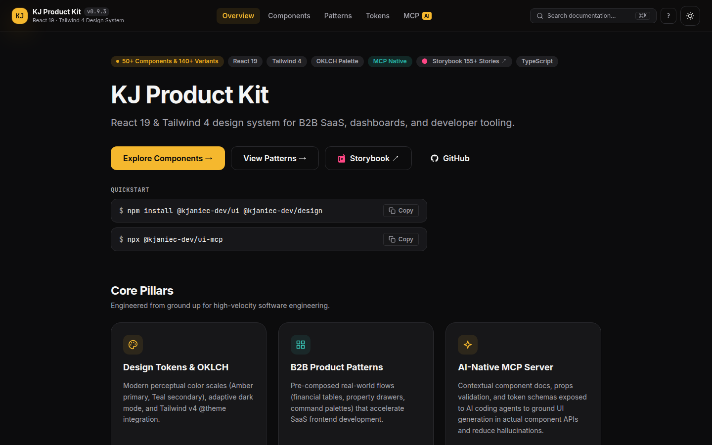
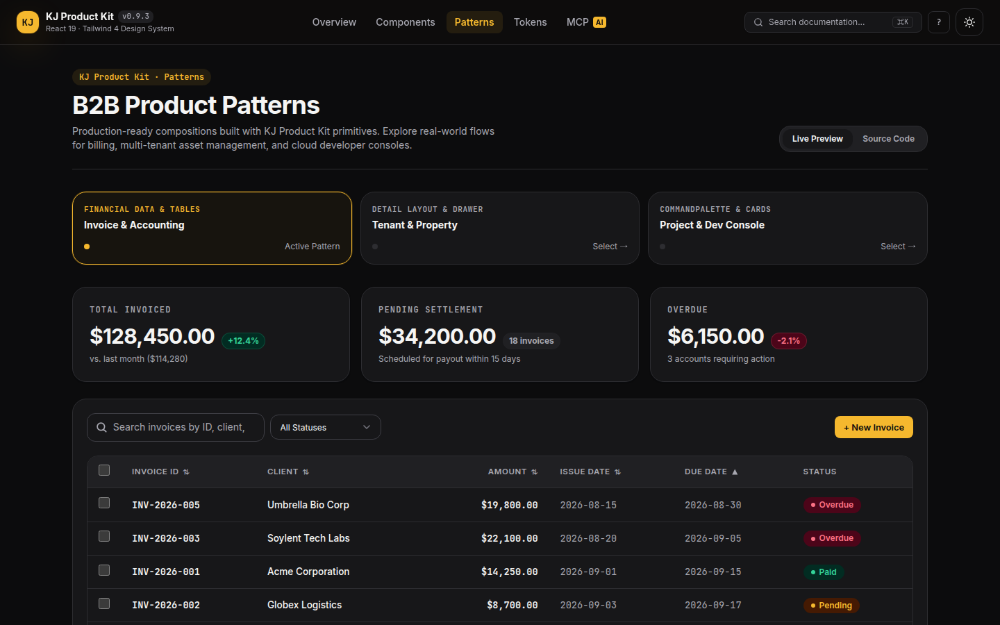
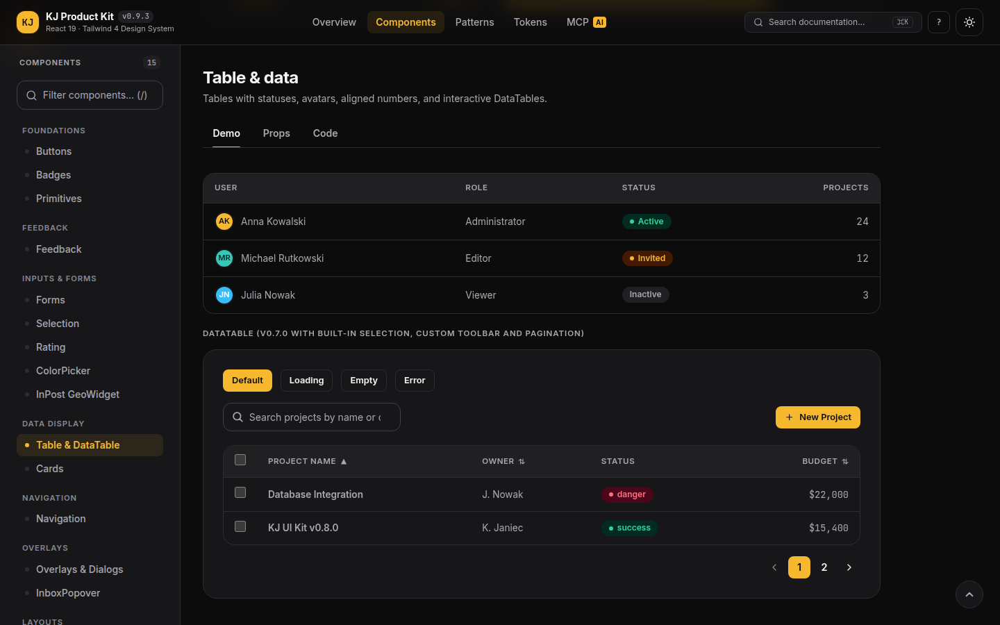
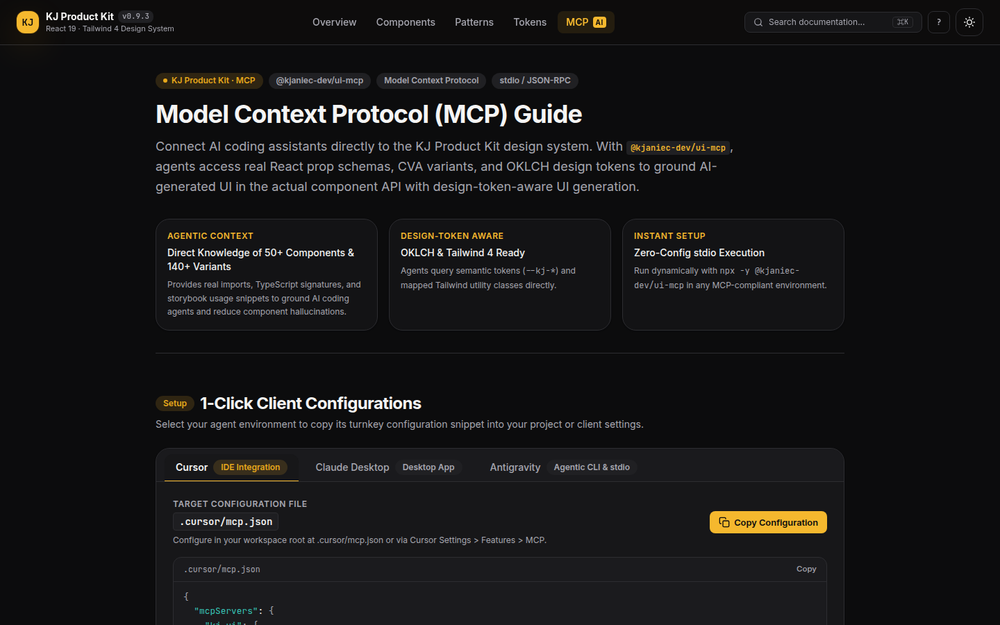

# KJ Product Kit

React 19 & Tailwind CSS 4 design system for B2B SaaS, dashboards, and developer tooling. Engineered with 70+ components, 150+ variants, production business patterns, OKLCH design tokens, and an AI-native Model Context Protocol (MCP) server.

**[⚡ Live Documentation & Interactive Demo](https://ui.kjaniec.dev)** · **[🎨 Storybook](https://6a1aa334e443b4184c139a6c-ybeikhkasj.chromatic.com/)** · **[📦 npm: @kjaniec-dev/ui](https://www.npmjs.com/package/@kjaniec-dev/ui)** · **[🤖 MCP Server: @kjaniec-dev/ui-mcp](https://www.npmjs.com/package/@kjaniec-dev/ui-mcp)**

---

## 🎨 Gallery Preview

<p align="center">
  
</p>
<p align="center">
  
</p>
<p align="center">
  
</p>
<p align="center">
  
</p>

---

## ✨ Features & Architecture

### Built for B2B Dashboards & Admin Panels
The kit is designed specifically for SaaS platforms, admin interfaces, and data-dense business apps. It includes key layout systems (`DashboardShell`, `SettingsLayout`, `DetailPageLayout`) and data grids (`DataTable` with selection, search, pagination, and sorting) that make building internal tools and B2B products extremely fast and visually coherent.

### Premium B2B Product Patterns
We provide realistic business dashboard patterns out-of-the-box:
- **Invoice & Accounting Dashboard**: Built using `DataTable` selection for bulk downloads, `TableToolbar` with date filters, and `MetricCard` for MRR and outstanding invoices.
- **Tenant & Property Manager**: Uses `Drawer` / `Sheet` for quick tenant settings, `DetailPageLayout` to inspect property stats, and `ConfirmDialog` to manage leases safely.
- **Project & Dev Console**: Outfitted with `CommandPalette` (`⌘K`) for fast developer navigation and keyboard-driven page redirects.

### AI-Assisted Product Development & MCP Server
KJ Product Kit features a first-class **Model Context Protocol (MCP) server** (`@kjaniec-dev/ui-mcp`). When using AI coding agents (like Gemini, Claude, or Cursor), the agent can query the design tokens and component specifications directly to write accurate, error-free UI code using this library.

#### MCP Query Example
AI agents can interact with the system by requesting information dynamically:
- `List Components`: Returns all components, variants, and descriptions.
- `Get Component (name: "DataTable")`: Fetches the API specifications, JSDoc parameters, and correct code examples for the requested component.
- `Get Design Tokens`: Returns the exact Tailwind v4 classes and CSS custom properties mapping.

---

## Packages

| Package | Description | Version |
|---|---|---|
| [`@kjaniec-dev/design`](./packages/design) | Design tokens, OKLCH scales, CSS custom properties, Tailwind v4 `@theme` | `1.0.0` |
| [`@kjaniec-dev/ui`](./packages/ui) | React 19 component library (70+ components, 150+ variants) | `1.0.0` |
| [`@kjaniec-dev/ui-mcp`](./packages/mcp) | AI-native Model Context Protocol server for Cursor, Claude & coding agents | `1.0.0` |

## Repo structure

```
packages/
  design/       ← Design tokens, OKLCH scales, and build script
    theme.css       CSS custom properties (--kj-*)
    tailwind.css    Tailwind v4 @theme bridge
    tokens.json     Raw token values
  ui/           ← React 19 UI component library
    src/components/ All 70+ components + Storybook stories
    src/index.ts    Barrel export
    tsup.config.ts  Builds ESM + CJS + .d.ts into dist/
  mcp/          ← Model Context Protocol server
    src/index.ts    Stdio MCP tools & resources for AI agents
    data/           Extracted component & token schemas
site/           ← Documentation & interactive showcase (Vite React app)
  src/views/        Overview, Components, Patterns, Tokens, MCP
docs/           ← Design guidelines & specifications
```

## Local development

```bash
npm install
```

**Component gallery** (Vite dev server):
```bash
npm run site:dev      # → http://localhost:5173
```

**Storybook** (live component dev):
```bash
npm run storybook     # → http://localhost:6006
```

## Using in a project

```bash
npm install @kjaniec-dev/ui @kjaniec-dev/design
```

Root CSS (import order matters — `@source` tells Tailwind v4 to scan the UI Kit components for utility classes):
```css
@import "tailwindcss";
@source "../node_modules/@kjaniec-dev/ui";
@import "@kjaniec-dev/design/tailwind.css";
@import "@kjaniec-dev/ui/ui.css";
```

Components:
```tsx
import { Button, Card, ToastProvider, useToast } from "@kjaniec-dev/ui";

function SaveButton() {
  const { toast } = useToast();
  return (
    <Button onClick={() => toast({ message: "Saved!", tone: "success" })}>
      Save
    </Button>
  );
}

export default function App() {
  return (
    <ToastProvider>
      <Card className="p-6">
        <SaveButton />
      </Card>
    </ToastProvider>
  );
}
```

Tailwind utilities (`bg-primary`, `text-muted-foreground`, `rounded-kj-md`, `shadow-kj-sm`, …) are registered automatically via the `@theme` block in `tailwind.css`.

## Publishing to npm

```bash
npm login

# design package (auto-builds via prepublishOnly)
cd packages/design && npm publish

# ui package (auto-builds via prepublishOnly)
cd packages/ui && npm publish
```

See [PUBLISHING.md](./PUBLISHING.md) for the full step-by-step guide.

## Chromatic (Storybook hosting)

Set your token in `.env.local` (gitignored):
```
CHROMATIC_PROJECT_TOKEN=chpt_xxxx
```

Publish:
```bash
source .env.local && npm run chromatic --workspace @kjaniec-dev/ui
```

## Deploy gallery to Netlify

The gallery app in `site/` is a Vite React application. Netlify will build it and deploy `site/dist`.

```bash
npm install -g netlify-cli
netlify login
netlify deploy --prod     # reads netlify.toml, runs build and deploys site/dist
```

## License & Author

Open source under the [MIT License](https://github.com/kjaniec-dev/ui-kit/blob/main/LICENSE) · Built by [Krzysztof Janiec](https://kjaniec.dev).
